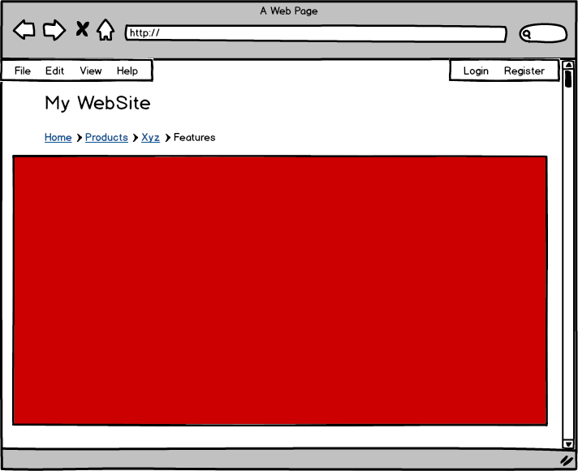
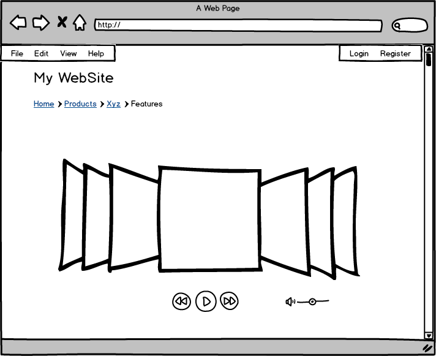
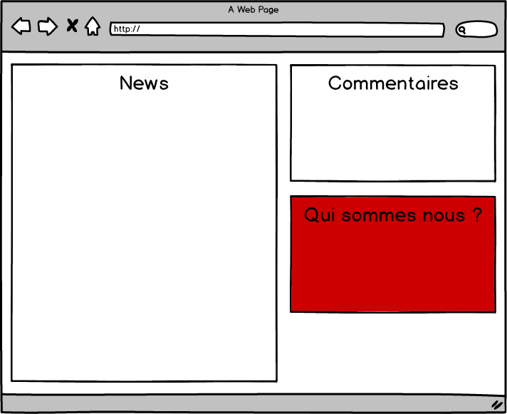
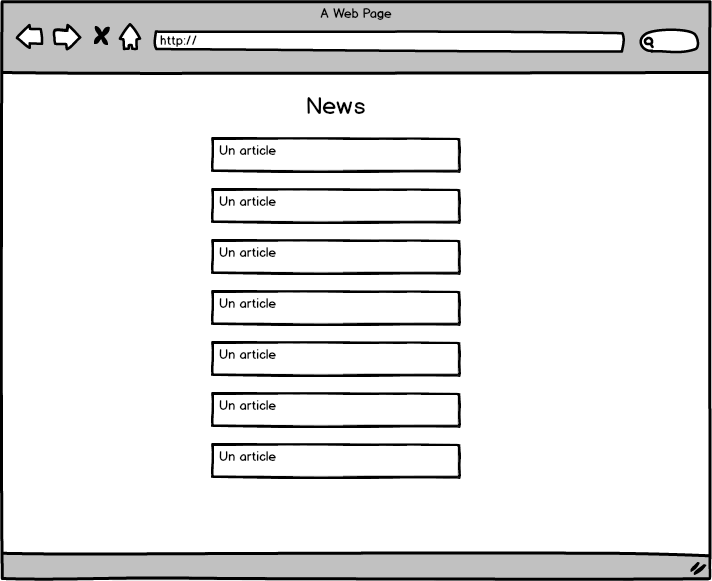
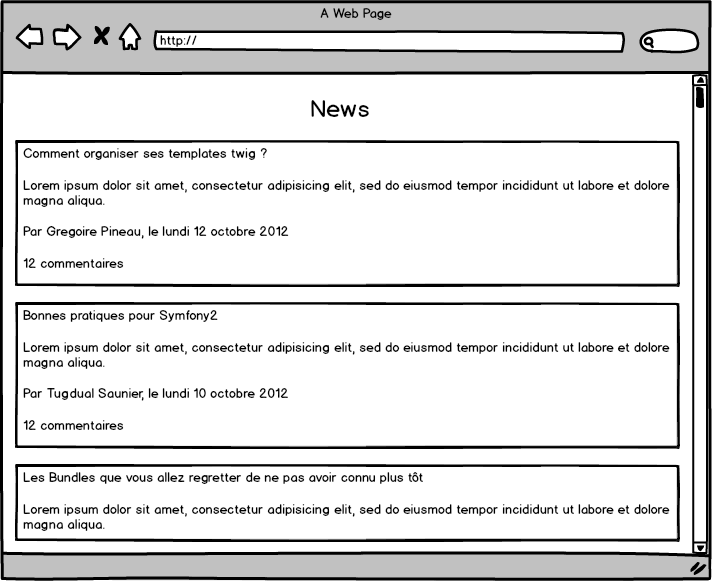
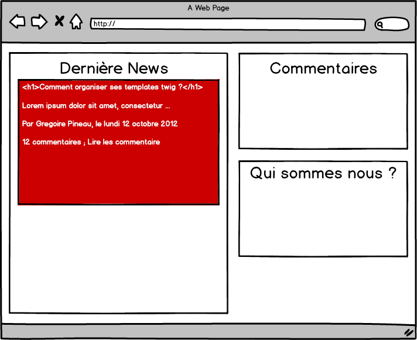

# Comment organiser ses templates twig ?

Grégoire Pineau - Symfony Live - Paris 2013

#

## Sommaire

1. Organisation des templates
2. Mise en place de thème

#

## Twig

## Installation

    php composer.phar require twig/twig:~1.12

## Configuration

    // twig.php

    require __DIR__.'/vendor/autoload.php';

    $loader = new Twig_Loader_Filesystem(array(__DIR__.'/templates'));

    $twig = new Twig_Environment($loader);

## utilisation

Template:

    {# hello.html.twig #}

    hello {{ name }}

Php:

    // hello.php

    require __DIR__.'/twig.php';

    echo $twig->render('hello.html.twig', array('name' => 'greg'));

Résultat:

    hello greg

#

## Extends

Pourquoi ? Quand ?

## Extends - Layout

## Extends - Homepage

## Extends - Layout #2

    {# layout.html.twig #}

    <html>
        <head>
            <title></title>
            
            
                
            
        </head>
        <body>
            Navigation
            Fil d'arianne
            
            
        </body>
    </html>

## Extends - Homepage #2

    {# homepage.html.twig #}

    

    

    
        {{ parent() }}
        
    

    
        Coverflow

        Boutons
    

## Résultat

    <html>
        <head>
            <title>Ma page</title>
            
            
        </head>
        <body>
            Navigation
            Fil d'arrianne
            Coverflow
            Boutons
        </body>
    </html>

#

## Include

Pourquoi ? Quand ?

## Include statique #1

## Include statique #2

    {# qui-sommes-nous.html.twig #}

    

        Qui sommes nous ?
    

::

    {# homepage.html.twig #}

    

        New
    

    

        Derniers Commentaires
    

    {{ include('qui-sommes-nous.html.twig') }}

## Include dynamique #1

## Include dynamique #2

    {# news.html.twig #}

    
        {{ include('post.html.twig', { post: post }, with_context = false) }}
    

::

    {# post.html.twig #}

    

        <h3>{{ post.title}}</h3>
        
{{ post.content }}

    

## Include

* Re-utilisation de code HTML
* Découpage fonctionnel (header / footer)
* Dynamique
* Structure HTML non flexible
* **Ne passer pas des flags pour ajouter de la flexibilité**

## Tips

* N'utiliser plus le tag, mais la fonction
* **Pensez à isoler vos include**

#

## Use

Pourquoi ? Quand ?

## Use #1

## Use #2

    {# blocks.html.twig #}

    
        

            Qui sommes nous ?
        

    

::

    {# homepage.html.twig #}

    {# ... #}

    

    {{ block('qui_sommes_nous') }}

    {# OU #}

    
        

            {{ parent() }}
        

    

## Use

* Ré-utilisation de code HTML
* Découpage fonctionnel (header / footer)
* Non dynamique
* Structure HTML non flexible
* Permet de partager plusieurs morceaux d'HTML dans le même fichier
* => Peu utilisé

#

## Embed

Pourquoi ? Quand ?

## Embed #1

## Embed #2

## Embed - liste

    {# news.html.twig #}

    
        
    

## Embed - Post

    {# post.html.twig #}

    

        <h3>{{ post.title}}</h3>

        
{{ post.content }}


        
            
Par {{ post.author }} le {{ post.date }}

        

        
            
il y a {{ post.comment|length }} commentaires

        
    

## Embed - home

    {# homepage.html.twig #}

    

        

            
                <h1>{{ post.title}}</h1>
            

            
                {{ parent() }}
Lire les commentaire

            

        
    

    

        Derniers Commentaires
    

    {{ include('include/qui-sommes-nous.html.twig') }}

## Embed

* Ré-utilisation de code HTML
* Découpage fonctionnel (header / footer)
* Dynamique
* **Flexible**

## Embed - Tips

* Ajouter autant de blocks que possible
* **Pensez à isoler vos embed**

#

## Macros

Pourquoi ? Quand ?

## Macros #1

    
        
            <input type="{{ type }}" name="{{ name }}" value="{{ value|e }}"
                size="{{ size }}" />
        
    

    
    {# ou #}
    

    {{ forms.input('user') }}
    {{ forms.input('email', 'email') }}

## Macros

* Génération de code HTML
* Dynamique
* Flexible

#

## Include / Use / Embed / Macro

Vous voulez:

* Génerer du code HTML dynamiquement : **macros**
* Découper votre template en (sous) templates (fonctionnel) : **include**
* Mutualiser du code HTML entre plusieurs templates : **include**
* Mutualiser et customiser du code HTML entre plusieurs templates : **embed**

Note:

Les fonctions twig ne sont pas faites pour générer du HTML ; Il en sera question un peu plus loin

#

## Theming

Comment construire un systeme de thème ?

**Use case**:

* Création de plusieurs sites avec un design approchant ("presque" semblable)
* Création d'un CMS / blog open source
* Sites en marque blanche

## Architecture

    themes
    ├── default
    │   ├── footer.html.twig
    │   ├── header.html.twig
    │   ├── homepage.html.twig
    │   └── layout.html.twig
    └── my_theme
        └── header.html.twig

## Thème par défaut / layout

    {# default/layout.html.twig #}

    <html>
        <head>
            <title></title>
        </head>
        <body>
            {{ include('logo.html.twig') }}

            

        </body>
    </html>

## Thème par défaut / templates

    {# default/homepage.html.twig #}

    

    
        Du contenu
    

::

    {# default/logo.html.twig #}

    

## Mon thème / Remplacement

    {# my_theme/logo.html.twig #}

    <h1>Mon site</h1>
    

## Résultat

    <html>
        <head>
            <title></title>
        </head>
        <body>
            <h1>Mon site</h1>
            

            Du contenu
        </body>
    </html>

## Comment ça marche ?

    require __DIR__.'/vendor/autoload.php';

    $loader = new Twig_Loader_Filesystem(array(
        __DIR__.'/templates/theming/my_theme',
        __DIR__.'/templates/theming/default',
    ));

    $twig = new Twig_Environment($loader);

    echo $twig->render('homepage.html.twig'); // <--- /!\ Attention

## Comment étendre la template de base ? #1

    themes
    ├── default
    │   ├── footer.html.twig
    │   ├── header.html.twig
    │   ├── homepage.html.twig
    │   └── layout.html.twig
    └── my_theme
        ├── homepage.html.twig
        └── header.html.twig

## Comment étendre la template de base ? #2

    {# my_theme/homepage.html.twig #}

    

    
        

            {{ parent() }}
        

    

## Comment étendre la template de base ? #3

Il faut ajouter le répertoire commun aux deux dossiers de thème :

    require __DIR__.'/vendor/autoload.php';

    $loader = new Twig_Loader_Filesystem(array(
        __DIR__.'/templates/theming/my_theme',
        __DIR__.'/templates/theming/default',
        __DIR__.'/templates/theming',          // <---- HERE
    ));

    $twig = new Twig_Environment($loader);

    echo $twig->render('homepage.html.twig');

## Remarque

Mais pourquoi Wordpress n'utilise pas twig pour ses templates ??????????????????

#

## Block Theming #1

Comment personaliser l'affichage des fonctions twig ?

**Use case**:

* Fil d'arianne
* Menu contextuel
* Embed de flash player
* Slider
* Pagination

----

*Note*: Ici un `include` / `embed` ne peut pas suffir, car il y a
potentiellement des besoins métiers (appel à la BDD, ...) qui ne peuvent /
doivent pas etre fait depuis une template.

## Block Theming #2

    {# layout.html.twig #}

    {{ display_menu(page|default(null)) }}

::

    <!-- Résultat -->

    <nav>
        <ul>
            <li><a href="#">A</a></li>
            <li><a href="#">B</a></li>
            <li><a href="#">C</a></li>
        </ul>
    </nav>

## Block Theming #2

* `display_menu` est une fonction twig qui va générer du contenu HTML.

* Nous voulons un support pour `display_menu`, `display_flash`,
  `display_pagination`,   `display_slider`, `display_*`

---

* Pour ajouter ces fonctions à twig, Nous allons:

    1. Créer une extension twig
    1. Créer une template contenant les blocks `menu`, `flash`,
        `pagination`, `slider`,  ...
    1. Utiliser les fonctions `display_*`

## Block Theming - Mise en place de l'extension #1

    class DisplayExtension extends \Twig_Extension
    {
        private $themes;

        public function __construct(array $themes = array())
        {
            $this->themes = $themes;
        }
    }

## Block Theming - Mise en place de l'extension #2

    public function getFunctions()
    {
        return array(
            new \Twig_SimpleFunction(
                'display_menu',
                array($this, 'displayBlock'),
                array('needs_environment' => true, 'is_safe' => array('html'))
            ),
        );
    }

## Block Theming - Mise en place de l'extension #3

    public function displayBlock(\Twig_Environment $env, $block = 'menu', $parameters = array())
    {
        foreach ($this->themes as $theme) {
            if ($theme instanceof \Twig_Template) {
                $template = $theme;
            } else {
                $template = $env->loadTemplate($theme);
            }
            if ($template->hasBlock($block)) {
                return $template->renderBlock($block, $parameters);
            }
        }

        throw new \InvalidArgumentException('Unable to find block '.$block);
    }

**Attention**: Ici on utilise une partie de l'API de twig qui n'est pas publique *

## Block Theming - Mise en place de l'extension #4

    $twig->addExtension(new DisplayExtension(array('display.html.twig')));

## Block Theming - Création d'un thème par default

    {# display.html.twig ; Notre template de blocks #}

    
    
        <nav>
            <ul>
                <li><a href="#">A</a></li>
                <li><a href="#">B</a></li>
                <li><a href="#">C</a></li>
            </ul>
        </nav>
    
    

    
    {# ... #}

    
    {# ... #}

    
    {# ... #}

## Block Theming - Mise en place de l'extension - Refacto #1

    public function getFunctions()
    {
        return array(
            new \Twig_SimpleFunction(
                'display_menu',
                array($this, 'displayMenu'),
                array('needs_environment' => true, 'is_safe' => array('html'))
            ),
            new \Twig_SimpleFunction(
                'display_*',
                array($this, 'displayBlock'),
                array('needs_environment' => true, 'is_safe' => array('html'))
            ),
        );
    }

## Block Theming - Mise en place de l'extension - Refacto #2

    public function displayMenu(\Twig_Environment $env, $page = null)
    {
        // Do what you need HERE.

        return $this->displayBlock($env, 'menu', array('page' => $page));
    }

## Block Theming - Création d'un tag pour changer le thème

Il faut ajouter un tag, qui va ajouter **à la compilation** un nouveau thème
pour la template courante.

Le code est un peu compliqué, mais il sera dans le dépôt ;)

## Block Theming - Création d'un tag pour changer le thème #2

    {# page.html.twig #}

    

    

    
        <h6>Menu:</h6>

        <nav class="class4">
            <ul class="class5">
                <li><a href="#">A</a></li>
                <li><a href="#">B</a></li>
                <li><a href="#">C</a></li>
            </ul>
        </nav>
    

    {{ display_menu(page|default(null)) }}

## Block Theming - Création d'un tag pour changer le thème #3

    <!-- Résultat -->
    <h6>Menu:</h6>

    <nav class="class4">
        <ul class="class5">
            <li><a href="#">A</a></li>
            <li><a href="#">B</a></li>
            <li><a href="#">C</a></li>
        </ul>
    </nav>

#

## Merci ! Des questions ?

#

Les slides:

* [https://github.com/lyrixx/SFLive-Paris2013-Twig](https://github.com/lyrixx/SFLive-Paris2013-Twig)

---

Sinon:

* [http://twitter.com/lyrixx](http://twitter.com/lyrixx)
* [http://github.com/lyrixx](http://github.com/lyrixx)
* [http://blog.lyrixx.info](http://blog.lyrixx.info)

---

Et:

* [SensioLabs Recrute](http://sensiolabs.com/fr/nous_rejoindre/pourquoi_nous_rejoindre.html)
